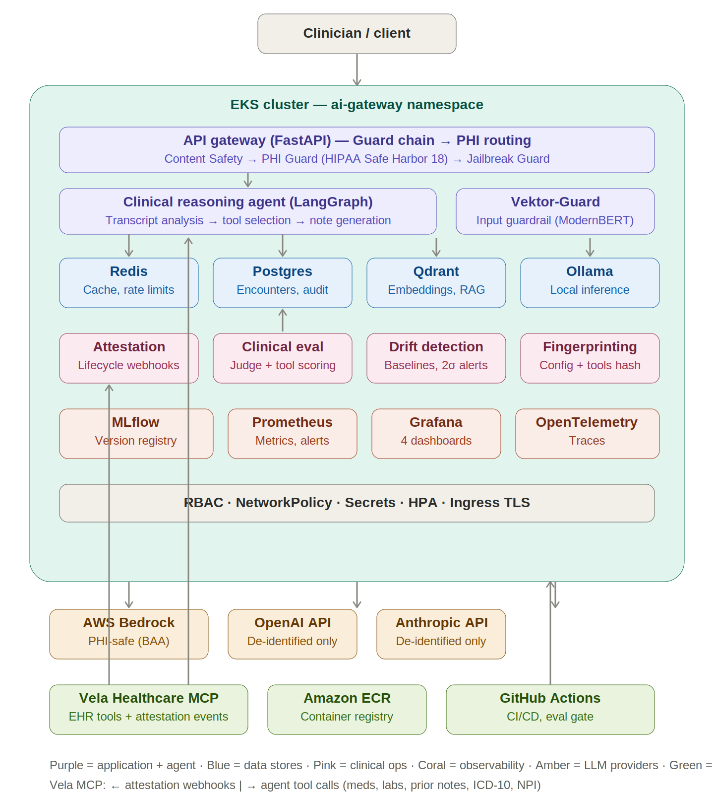

# Clinical LLMOps Platform


A reference architecture for the **LLMOps layer** around ambient clinical documentation — agentic note generation with MCP tool integration, evaluation, attestation telemetry, compliance-aware routing, drift detection, and audit infrastructure that any health system would need regardless of which scribe vendor they use.

## What This Is

An operational infrastructure platform that addresses three gaps in ambient clinical documentation deployments: no attestation verification (did the clinician actually read the AI-generated note before signing?), thin evaluation practices (no CI gate catching regression when prompts or models change), and binary PHI routing (no per-request policy engine based on payload content). The scribe endpoint is a LangGraph clinical reasoning agent that pulls patient context via MCP tool calls before generating structured notes.

## What This Is Not

Not a clinical scribe product. It doesn't compete with Nuance DAX, Abridge, or Suki. It doesn't own the microphone, the speech-to-text, the EHR integration, or the clinical NLP. The clinical reasoning agent exists as a reference target so the ops layer has something to evaluate against.

---

## Architecture

Three layers, built bottom-up:

### Layer 1 — Data Plane (built)

Production-grade LLM gateway with multi-provider routing and content safety guardrails. Kubernetes-native, config-driven, deployed to both minikube (local) and EKS (cloud).

- **API Gateway** — FastAPI with OpenAI-compatible chat completions endpoint
- **Guard Chain** — Content Safety -> PII/PHI Guard -> Jailbreak Guard, sequential defense-in-depth
- **Provider Routing** — `rank_providers()` with private flag, PHI compliance, cost ceiling, model matching, automatic fallback
- **Caching & State** — Redis for response caching, rate limiting, per-provider usage tracking

### Layer 2 — Clinical Ops Plane (in progress)

The layer that doesn't exist in the ambient documentation market today.

- **Clinical Reasoning Agent** — LangGraph agent that analyzes transcripts, decides which patient context to retrieve via MCP tools, then generates structured notes with full context
- **Vela Healthcare MCP** — Bidirectional integration: tool server providing patient context (medications, labs, prior notes, ICD-10, NPI, allergies) and webhook source for attestation lifecycle events
- **Encounter Persistence** — every inference call scoped to an `encounter_id`, tool calls logged, append-only audit trail
- **PHI-Aware Policy Engine** — HIPAA Safe Harbor identifiers, `contains_phi=true` routes to BAA-covered providers only
- **Attestation Lifecycle** — generated -> delivered -> viewed -> edited -> signed, key metric: `signed_without_view_rate`
- **Version Fingerprinting** — hash of prompt version, guardrail config, routing policy, provider, model revision, and tools invoked per note

### Layer 3 — Evaluation & Observability Plane (planned)

What catches problems before they reach patients.

- **Clinical Eval Module** — LLM judge for faithfulness/completeness, deterministic checks for PHI leakage and format compliance, **tool selection quality scoring** (did the agent call the right MCP tools?), CI gate at >2% regression
- **Drift Detection** — Prometheus recording rules, 14-day rolling baselines, Alertmanager at >2 sigma deviation
- **Dashboards** — Clinical Quality, Attestation Compliance, Unit Economics, Inference Health

### Physical Architecture



### Guard Chain

```
Request -> Guard 1: Content Safety -> Guard 2: PHI Guard -> Guard 3: Jailbreak Detection -> Agent
              | keyword scan            | HIPAA Safe Harbor     | layered analysis            |
              | block harmful intent    | block or redact PHI   | block injection attempts    |
              v                         v                       v                             v
          400 Block                 400 Block/Redact         400 Block               Clinical Reasoning
                                                                                    Agent (LangGraph)
                                                                                         |
                                                                                    MCP tool calls
                                                                                         |
                                                                                  rank_providers()
                                                                                         |
                                                                              +----------+----------+
                                                                              v          v          v
                                                                          Provider 1  Provider 2  Provider N
```

### Routing Decision Flow

```
rank_providers(request)
    |
    +- private=true? -> [Ollama only]
    |
    +- contains_phi=true? -> [Bedrock, Ollama] (BAA-covered only; vLLM added Phase 14)
    |
    +- explicit provider? -> [requested, then fallbacks]
    |
    +- max_cost set? -> filter by budget, sort cheapest first
    |
    +- model match? -> providers supporting model, sorted by cost
    |
    +- fallback -> any available provider -> Ollama last resort
```

---

## Technology Stack

### Data Plane (built)

| Component | Purpose |
|-----------|---------|
| **Kubernetes** | EKS 1.31 (cloud), minikube (local dev) |
| **FastAPI + Uvicorn** | API gateway, async request handling |
| **Pydantic v2** | Request/response validation, domain models |
| **Redis** | Response caching, rate limiting, usage tracking (30-day TTL) |
| **Ollama** | Local LLM inference, always-available fallback, PHI-safe (vLLM primary in Phase 14) |
| **Qdrant** | Vector store for embedding storage, RAG support |
| **httpx** | Async HTTP client for provider API calls |
| **Python 3.11** | Runtime |

### Clinical Ops Plane (in progress)

| Component | Purpose |
|-----------|---------|
| **LangGraph** | Clinical reasoning agent orchestration — transcript analysis, tool selection, note generation |
| **MCP (Model Context Protocol)** | Standard tool interface between agent and Vela Healthcare EHR |
| **PostgreSQL 16** | Encounter persistence, audit events, note versions, tool call logs, attestation lifecycle |
| **SQLAlchemy 2.0 (async)** | ORM with `asyncpg` driver |
| **Alembic** | Schema migrations |
| **Presidio** | NER layer for PHI names and geographic subdivisions (Safe Harbor #1, #2) |
| **MLflow** | Artifact versioning for prompts, guardrail configs, routing policies, agent graph config |
| **Vela Healthcare MCP** | Bidirectional: MCP tool server (meds, labs, notes, ICD-10, NPI) + attestation webhook source |
| **Vektor-Guard** | ModernBERT prompt injection detection model |

### Evaluation & Observability (planned)

| Component | Purpose |
|-----------|---------|
| **LLM Judge** | Faithfulness and completeness scoring |
| **Tool Selection Scorer** | Evaluates whether the agent called the right MCP tools for the transcript |
| **Prometheus** | Metrics, recording rules, 14-day baselines, Alertmanager |
| **Grafana** | Four dashboards, JSON definitions committed to repo |
| **OpenTelemetry** | Distributed tracing including agent tool call decisions |

### Infrastructure

| Component | Purpose |
|-----------|---------|
| **Docker** | Container builds, current image `ai-gateway:v22` (local) / `v21` (ECR) |
| **Amazon ECR** | Private container registry |
| **EKS** | 3x `t3.medium` workers, `us-west-2`, eksctl-managed (GPU nodegroup in Phase 14) |
| **Kustomize** | Base + overlays (dev/prod) |
| **GitHub Actions** | CI/CD, eval gate integration |

---

## Project Phases

### Foundation — Kubernetes & Infrastructure (Phases 1–7)

| Phase | Focus | Status | Key Learnings |
|-------|-------|--------|---------------|
| 1 | K8s Foundation | Complete | Pods, Deployments, Services, Labels |
| 2 | Configuration | Complete | ConfigMaps, Secrets, Kustomize |
| 3 | Persistence | Complete | PVCs, StatefulSets, Headless Services |
| 4 | Observability | Complete | Probes (startup/liveness/readiness), Resource Limits |
| 5 | Deployment Strategies | Complete | Rolling Updates, Rollbacks, Blue-Green |
| 6 | Scaling | Complete | HPA, Metrics Server, Load Testing |
| 7 | Ingress & Security | Complete | Ingress, NetworkPolicies, RBAC |

### LLM Gateway — Routing & Guardrails (Phases 8–11)

| Phase | Focus | Status | Key Learnings |
|-------|-------|--------|---------------|
| 8 | Provider Routing | Complete | Modular provider architecture, config-driven routing |
| 9 | Router Enhancements | Complete | Private flag, cost-based ranking, fallback chains |
| 10 | Guardrails Phase 1 | Complete | Content safety, 12 threat categories |
| 11a | Guardrails Phase 2a | Complete | PII detection & masking (6 types, 3 strategies, 27 tests) |
| 11b | Guardrails Phase 2b | Complete | Jailbreak detection (3 layers, confidence scoring, 16 tests) |
| — | OpenAI Provider | Complete | Live-tested with real API calls, prefix routing fix |

### Cloud Deployment (Phases 12, 15–16)

| Phase | Focus | Status | Key Learnings |
|-------|-------|--------|---------------|
| 12 | EKS Deployment | In Progress | ECR repo + image pushed, eksctl config, prod overlay |
| 15 | ArgoCD GitOps | Deferred | Declarative application delivery |
| 16 | Terraform IaC | Deferred | Infrastructure as Code |

### Ambient Clinical Documentation Ops (Phase 13a–13i)

| Phase | Focus | Status |
|-------|-------|--------|
| 13a | Encounter domain model + data plane | Complete |
| 13b | PHI Guard + compliance-aware routing | In Progress |
| 13c | Clinical reasoning agent (LangGraph + MCP) | Planned |
| 13d | MLflow registry + version fingerprinting | Planned |
| 13e | Clinical eval module + tool selection scoring + CI gate | Planned |
| 13f | Attestation telemetry | Planned |
| 13g | Drift detection service | Planned |
| 13h | Observability stack + dashboards | Planned |
| 13i | EKS redeploy + end-to-end demo | Planned |

### Local Serving Refactor (Phase 14)

| Phase | Focus | Status |
|-------|-------|--------|
| 14 | vLLM migration (vLLM primary, Ollama availability fallback) | Planned |

### Security Assessment (Phases 17–20)

| Phase | Focus | Status |
|-------|-------|--------|
| 17 | Local security baseline (kind + kube-bench + kube-hunter) | Planned |
| 18 | EKS security audit | Planned |
| 19 | Intentional misconfiguration lab | Planned |
| 20 | Remediation and hardening | Planned |

---

## Current Guardrails

### Guard 1: Content Safety

Keyword-based scanning across 12 threat categories: self-harm, violence, hate speech, sexual content, illegal activity, controlled substances, weapons, cyber crime, child safety, terrorism, prompt injection, offensive language.

### Guard 2: PII Detection & Masking

| PII Type | Severity | Default Action | Masking Example |
|----------|----------|----------------|-----------------|
| SSN | Critical | Block | `[REDACTED_SSN]` or `***-**-6789` |
| Credit Card | Critical | Block | `****-****-****-1111` |
| Email | High | Redact | `****@domain.com` |
| Phone | High | Redact | `[REDACTED_PHONE]` |
| IP Address | Medium | Log | `[REDACTED_IP_ADDRESS]` |
| Date of Birth | High | Redact | `[REDACTED_DOB]` |

**Masking strategies:** full, partial (last 4 visible for SSN/credit card/email; type label otherwise), hash (deterministic SHA-256 prefix). Worst-wins escalation across multiple PII types in a single request.

### Guard 2+: PHI Detection (HIPAA Safe Harbor) — In Progress

Extends PII coverage to HIPAA Safe Harbor identifiers on the `/v1/clinical/notes` endpoint. Two-tier detection:

- **Regex layer (15 patterns)** — structured identifiers: SSN, credit card, email, phone, IP, dates, MRN, health plan ID, fax, URL, VIN, license plate, license/cert number, device ID, account number. Keyword-anchored patterns capture only the value so labels are preserved in redaction (`MRN: [REDACTED_MRN]`).
- **NER layer (Presidio, next)** — names (#1) and geographic subdivisions including ZIP (#2), which shape-matching regex cannot reliably distinguish from clinical numeric text.

Each pattern carries a `phi_category` Safe Harbor tag for audit rollup. On detection, sets `contains_phi=true` to constrain routing to BAA-covered providers. `contains_phi` and `passed` are independent: PHI presence constrains routing even when the action allows the request through.

Safe Harbor #17 (photographs) is out of scope (text-only pipeline); #18 (catch-all unique identifiers) is handled by keyword detection.

### Guard 3: Jailbreak Detection

| Layer | Confidence | Examples |
|-------|------------|---------|
| Exact Phrases | 1.0 | "You are now DAN", "ignore previous instructions" |
| Fuzzy Patterns | 0.6–0.9 | Role hijacking, delimiter injection, encoding tricks |
| Structural | 0.3–0.7 | Zero-width chars, conversation faking, script mixing |

Confidence threshold gating at 0.7 default. Structural signals accumulate with boost formula.

---

## API Endpoints

| Endpoint | Method | Description |
|----------|--------|-------------|
| `/health` | GET | Health check for K8s probes |
| `/config` | GET | Display current configuration |
| `/providers` | GET | List configured LLM providers |
| `/settings` | GET | Show routing settings and provider costs |
| `/v1/chat/completions` | POST | OpenAI-compatible chat endpoint |
| `/v1/encounters` | POST | Create an encounter (persisted, audit-scoped) |
| `/v1/clinical/notes` | POST | Clinical reasoning agent endpoint (planned) |
| `/redis-test` | GET | Verify cache connectivity |

### Example: Chat Completion

```bash
curl -X POST http://localhost:8080/v1/chat/completions \
  -H "Content-Type: application/json" \
  -d '{
    "model": "gpt-4.1-mini",
    "messages": [{"role": "user", "content": "Explain Kubernetes in one sentence"}]
  }'
```

### Example: Private Routing

```bash
curl -X POST http://localhost:8080/v1/chat/completions \
  -H "Content-Type: application/json" \
  -d '{
    "model": "gpt-4",
    "messages": [{"role": "user", "content": "Process this sensitive data"}],
    "private": true
  }'
```

### Example: Jailbreak Blocked

```json
{
  "detail": {
    "error": "Jailbreak attempt detected",
    "message": "Jailbreak detected: delimiter_injection"
  }
}
```

---

## Project Structure

```
clinical-llmops-platform/           # local dir: ~/projects/kubernetes-ai-gateway
├── api-gateway/
│   ├── main.py                     # FastAPI app — guards, routing, endpoints
│   ├── models.py                   # Pydantic models (ChatRequest, EncounterRequest)
│   ├── database.py                 # async engine, session factory, get_session()
│   ├── providers/
│   │   ├── base.py                 # LLMProvider ABC, supports_model prefix matching
│   │   ├── ollama.py               # Local inference provider
│   │   ├── openai.py               # OpenAI provider (tested)
│   │   ├── anthropic.py            # Anthropic provider (planned)
│   │   ├── bedrock.py              # AWS Bedrock provider (planned, required for PHI)
│   │   └── vllm.py                 # vLLM provider (planned — Phase 14)
│   ├── guardrails/
│   │   ├── base.py                 # GuardrailBase ABC, enums, GuardrailResult
│   │   ├── content_safety.py       # Guard 1: keyword scan
│   │   ├── pii_guard.py            # Guard 2: PII detection & masking
│   │   ├── phi_guard.py            # Guard 2+: HIPAA Safe Harbor (in progress)
│   │   └── jailbreak_guard.py      # Guard 3: 3-layer detection
│   ├── clinical/                   # Phase 13
│   │   ├── db_models.py            # SQLAlchemy models (6, mapped to Postgres)
│   │   ├── agent.py                # LangGraph clinical reasoning agent (planned)
│   │   ├── tools.py                # MCP tool definitions for the agent (planned)
│   │   ├── attestation.py          # Lifecycle tracking + webhook receiver (planned)
│   │   ├── fingerprint.py          # Version fingerprint generation (planned)
│   │   └── eval/                   # Clinical eval module (planned)
│   │       ├── judge.py            # LLM judge — faithfulness, completeness
│   │       ├── deterministic.py    # PHI leakage, format compliance, length
│   │       ├── tool_scorer.py      # Tool selection quality scoring
│   │       ├── scorer.py           # Aggregates all scoring dimensions
│   │       └── runner.py           # Orchestrates scoring from Postgres
│   ├── tests/
│   │   ├── test_guardrails.py      # Content safety tests
│   │   ├── test_pii_guard.py       # PII guard tests (27 passing)
│   │   ├── test_phi_guard.py       # PHI guard tests (in progress)
│   │   └── test_jailbreak_guard.py # Jailbreak guard tests (16 passing)
│   ├── requirements.txt
│   └── Dockerfile
├── db/
│   ├── migrations/                 # Alembic (baselined)
│   └── schema.sql                  # 6 tables + 7 indexes
├── alembic.ini
├── eks/
│   └── cluster.yaml                # eksctl config (3x t3.medium, us-west-2)
├── manifests/
│   ├── base/                       # Shared K8s manifests (incl. postgres-*)
│   └── overlays/
│       ├── dev/
│       └── prod/                   # ECR image, 3 replicas, prod log level
├── golden-set/
│   └── transcripts/                # 5 synthetic transcripts (card/pc/ortho/psych/em)
├── docs/
│   ├── architecture.md             # Design document
│   ├── architecture_v3.png         # Physical architecture diagram
│   ├── schema_erd.png              # Database ERD
│   └── ROADMAP.md
├── .gitignore
└── README.md
```

---

## Key Design Decisions

| Decision | Rationale |
|----------|-----------|
| **Gateway pattern** | Swap providers without code changes, centralized cost tracking, compliance routing |
| **Config-driven guardrails** | Update rules via ConfigMap without rebuild, environment-specific, audit-friendly |
| **Ranked fallback** | `rank_providers()` returns priority-ordered list — provider failure falls through, not fails |
| **Two-tier PHI detection** | Regex for structured identifiers (deterministic, auditable), Presidio NER for names/geography (context-dependent) — right tool per identifier class |
| **contains_phi as routing axis** | PHI presence constrains routing to BAA providers independently of block/allow — routing and blocking are separate concerns |
| **LangGraph agent** | Clinical reasoning requires dynamic tool selection, not a fixed pipeline — the agent decides what context to pull based on transcript content |
| **MCP tool integration** | Standard protocol for agent-to-EHR communication, bidirectional (tool calls out, attestation events in) |
| **Tool selection scoring** | Evaluating agent decisions (which tools were called) alongside note quality — unique eval dimension |
| **Internal eval module** | Purpose-built for clinical note + agent scoring, not forced into a generic agent evaluation framework |
| **Attestation telemetry** | No vendor currently exposes signed-without-view rate — the single most distinctive piece |
| **Version fingerprinting** | Reconstruct exact inference configuration and agent reasoning path for any encounter months later |

---

## Security

- **RBAC** — Dedicated `api-gateway-sa` ServiceAccount, least-privilege (get/list ConfigMaps, Secrets, Pods)
- **NetworkPolicy** — Redis access restricted to `app=api-gateway` pods only
- **Secrets** — `llm-api-keys` injected as env vars, never committed to git
- **Ingress** — nginx controller with TLS
- **Guard chain** — Three sequential guardrails, cheapest check first, config-driven

---

## Local Development

### Prerequisites

Docker, minikube, kubectl, AWS CLI, eksctl

### Quick Start

```bash
minikube start --driver=docker --cpus=4 --memory=8192
kubectl create namespace ai-gateway
kubectl config set-context --current --namespace=ai-gateway
eval $(minikube docker-env)

cd api-gateway
docker build -t ai-gateway:v22 .
cd ../manifests/base
kubectl apply -k .

kubectl create secret generic llm-api-keys \
  --from-literal=OPENAI_API_KEY=your-key \
  --from-literal=ANTHROPIC_API_KEY=your-key

kubectl port-forward service/api-gateway 8080:80
curl http://localhost:8080/health
```

### Running Tests

```bash
cd api-gateway
PYTHONPATH=. python tests/test_guardrails.py      # Content safety (5 tests)
PYTHONPATH=. python tests/test_pii_guard.py       # PII detection (27 tests)
PYTHONPATH=. python tests/test_jailbreak_guard.py # Jailbreak detection (16 tests)
```

---

## Author

**Matt Sikes** — Principal Architect specializing in AI infrastructure and cloud solutions

## License

MIT